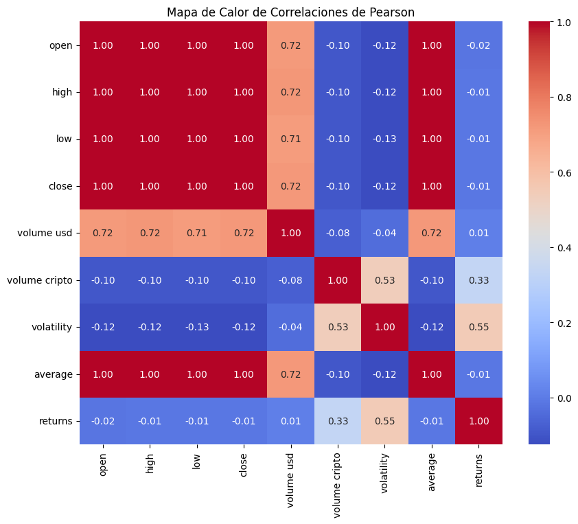
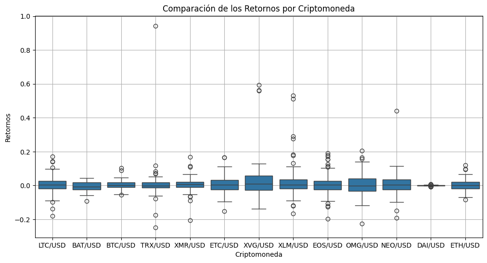

# 📊 **Análisis Estadístico y Predicción de Precios de Criptomonedas**


## 🚀 **Descripción del Proyecto**
Este proyecto se centra en el análisis estadístico y la predicción de precios de criptomonedas utilizando datos históricos diarios. Incluye un enfoque en el análisis exploratorio de datos, identificación de patrones estadísticos, predicción mediante modelos avanzados y compresión de datos para obtener una visión general del mercado.

### **Objetivos principales:**

1. Analizar distribuciones de los parametros analisados de las criptomonedas, para entender su comportamiento.
2. Identificar tendencias, correlaciones y patrones en los datos históricos.
3. Comprimir la información de múltiples criptomonedas para realizar un análisis general del mercado.
4. Comparar métodos de estimación, como interpolación y modelos de series temporales (ARIMA).

---

## 📂 **Estructura del Proyecto**

```

Cripto/
├── 📂 db/                     # Contiene todos los archivos CSV con los datos de las criptomonedas.
│   ├──📂 merge/
│   │   └── merge.csv          # En este archivo se guardan los datos mas importantes de cada criptomoneda para hacer un analisis general del mercado
│   │ 
│   ├── BATUSD.csv
│   ├── ...
│   └── XVGUSD.csv
│
├── 📂 notebooks/              # Notebooks para análisis interactivo y visualizaciones.
│   ├── eda.ipynb              # Análisis Exploratorio de Datos
│   ├── distribuciones.ipynb   # Análisis de distribuciones
│   └── predicciones.ipynb     # Modelos de predicción
│
├── 📂 src/                    # Código fuente estructurado para análisis y automatización.
│   ├── Analisis_Distribucion.py      
│   ├── ...    
│   └── repair_db          
│
├── 📂 reports/                # Guarda gráficos y reportes generados.
│   ├── correlacion.png
│   └── distribucion_volatilidad.png
│   
├── 📂 .kaggle/                # Obtener en la pagina oficial de  Kaggle una credencial ( kaggle.json ) y 
│   └── kaggle.json              copiarlo dentro de .kaggle/ para automatizar la descarga del dataset.
│
├── README.md
└── requirements.txt

```


---

## ⚙️ **Requisitos**

### **Uso de un entorno virtual (opcional)**
Este paso no es necesario, pero podria evitar errores de compatibilidad entre los modulos de python

#### Creacion del entorno virtual:

```bash
python3 -m venv env
```

#### Activacion del entorno creado:
```bash
source env/bin/activate
```

Ya sea que que crearas un entorno virtual o no, asegurate de tener instaladas las siguientes herramientas y librerías para ejecutar el proyecto:

### **Instalación de dependencias:**
```bash
pip install -r requirements.txt
```

---
## 🛠️ **Funcionalidades Implementadas**
 
1. Análisis Exploratorio de Datos (EDA):

    Visualización de distribuciones de precios (histogramas y KDE).
    Análisis de tendencias.
    Detección de outliers mediante boxplots.

2. Análisis de Distribuciones:

    Ajuste de distribuciones comunes (Normal, Log-Normal, T-Student, etc).
    Tests de normalidad (Kolmogorov-Smirnov, Shapiro-Wilk).


3. Comparación de Métodos de Estimación:

    Interpolación lineal y cúbica para precios de cierre.
    Modelos de series temporales ARIMA y SARIMA.
    <!-- Evaluación de precisión con métricas como MAE y RMSE. -->

4. Compresión y Resumen del Mercado:

    Reducción de dimensionalidad usando PCA.
    <!-- Clustering jerárquico y K-means para agrupar criptomonedas similares. -->

---
## 📊 **Ejemplos de Visualizaciones**
 
**Mapa de correlación entre variables*


**Retornos de las criptomonedas**


---
## 🚀 **Próximos Pasos**

    Implementar simulaciones de Monte Carlo para análisis de riesgo.
    Desarrollar un sistema de visualización interactiva para análisis avanzado.
    Explorar modelos avanzados de predicción como redes neuronales recurrentes (RNN).

---
## 🤝 **Desarrolladores**

1.  **Glenda Rios Rodriguez**
2. **Victor Vena Barrios**
3. **Darío López Falcón** 

---
## 📜 **Licencia**

Este proyecto está licenciado bajo la licencia MIT. Consulta el archivo LICENSE para más detalles.
🌟 Contribuciones

¡Las contribuciones son bienvenidas! Si deseas colaborar, por favor abre un issue o envía un pull request con tus sugerencias.